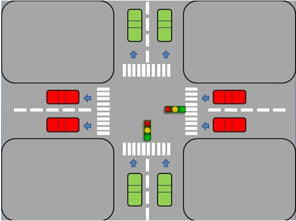
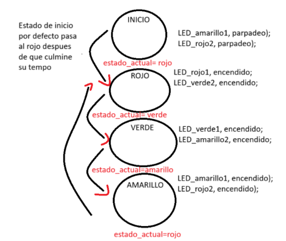

# Práctica 2_B: Control de Semáforo con Controllino 

-  Se diseña un sistema que controle dos semáforos (Semáforo A y Semáforo B) ubicados en una intersección perpendicular, usando el enfoque de máquina de estados finita(FSM).El sistema debe simular el comportamiento simple de los semáforos, de manera que nunca haya luz verde simultánea para ambos sentidos, y se respeten los tiempos estándar de duración  de cada luz.

---
## Materiales requeridos
- Tablero de control con Controllino Mega integrado.
- Fuente de alimentación del tablero.
- Cable USB tipo B 2.0.
- PC con Arduino IDE instalado y configurado para Controlli
- 6 LEDs del tablero (divididos en dos conjuntos):
  - Primer conjunto: **LED_ROJO**, **LED_AMARILLO** y **LED_VERDE**
  - Segundo conjunto: **LED_ROJO2**, **LED_AMARILLO2** y **LED_VERDE2**
---
## Requisitos:

El objetivo es demostrar el uso de:
- **Máquinas de estados** mediante `enum` y `switch`.
- **Temporización no bloqueante** con `millis()`.
---
## Diagrama de estados:

---
## Funciones principales
- setup():
Configura los pines de los LEDs como salidas y apaga todos los LEDs inicialmente usando la función apagarTodo().

- loop():
Implementa la máquina de estados:

1. Estado INICIO:
Parpadea el LED_AMARILLO del primer conjunto y el LED_ROJO2 del segundo conjunto durante 2.5 segundos.

2. Estado ROJO:
Enciende el LED_ROJO del primer conjunto y el LED_VERDE2 del segundo conjunto por 3 segundos.

3. Estado VERDE:
Activa el LED_VERDE del primer conjunto y el LED_AMARILLO2 del segundo conjunto durante 2 segundos.

3. Estado AMARILLO:
Enciende el LED_AMARILLO del primer conjunto y el LED_ROJO2 del segundo conjunto por 2 segundos, y luego regresa al estado ROJO.

- Función apagarTodo():
Apaga todos los LEDs para reiniciar el estado visual antes de la transición
