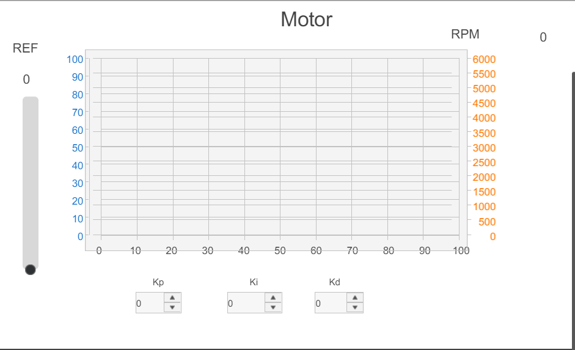

#  Práctica 4: Control básico de salidas digitales 
  Diseñare implementar un controlador PID que regule automáticamente la velocidad del motor DC del EPC a un valor de referencia definido por el usuario mediante la
 interfaz HMI.

---
# Materiales requeridos
 - Tablero de control con Controllino Mega integrado.
 - Fuente de alimentación del tablero.
 - Cable USB tipo B 2.0.
 - Cable USB tipo A a A.
 - PC con Arduino IDE instalado y configurado para Controllino
 - Software Stone Designer GUI.
 - 6jumpers macho ahembra largos.
 - 6jumpers macho amacholargos.
 - Destornillador plano pequeño
---
## Reto:
 Diseñar e implementar un controlador PID que regule automáticamente la velocidad
 del motor DC del EPC a un valor de referencia definido por el usuario mediante la
 interfaz HMI.
 Cada grupo de trabajo deberá implementar un sistema de control PID que cumpla
 con las siguientes condiciones:
 - La velocidad del motor debe alcanzar el valor de referencia en el menor
 tiempo posible, sin sobrepasarlo excesivamente.
 - El sistema debe mostrar estabilidad (sin oscilaciones) y un error en estado
 estacionario inferior al 5%.
 - El sistema debe mostrar en tiempo real: valor de referencia (setpoint) en el
 slider, velocidad actual (RPM), gráfica de la señal de control, comparativa
 entre referencia y velocidad actual.
 Restricciones:
 - El algoritmo PID debe ser implementado en código mediante la ecuación de
 recurrencias (no se permite el uso de librerías PID externas).

---
## Caracteristicas

###Este sistema permite:

- Lectura de la referencia desde un `slider` en la pantalla HMI.
- Ajuste de parámetros PID (`Kp`, `Ki`, `Kd`) mediante `spin boxes`.
- Medición de la velocidad del motor en **RPM** a través de pulsos de un encoder.
- Aplicación de control PID en tiempo real usando **ecuación de recurrencias**.
- Visualización de:
  - Referencia
  - Velocidad del motor (RPM)
  - Señal de control `u(t)`
  - Todo mostrado en una gráfica del HMI.
  - Comunicación serial bidireccional entre el HMI y el Controllino.
---
## Configuración del sistema

### Conexiones

| Elemento           | Pin Controllino  |
|--------------------|------------------|
| PWM al motor       | D0               |
| Entrada de encoder | IN1              |
| HMI (Serial2)      | TX2 / RX2        |

---

### Variables de entrada desde HMI

| Componente HMI | Función              | Rango sugerido |
|----------------|----------------------|----------------|
| `slider1`      | Referencia (RPM)     | 0 – 4000       |
| `spin_box1`    | `Kp` (proporcional)  | 0.01 – 1.00    |
| `spin_box2`    | `Ki` (integral)      | 0.01 – 1.00    |
| `spin_box3`    | `Kd` (derivativo)    | 0.001 – 1.00   |

---

## Lógica del control PID

- Se utiliza la **forma discreta por ecuación de recurrencias** para calcular `u(t)`:
  
```math
u[k] = u[k-1] + Kp * (e[k] - e[k-1]) + (T * Ki) * e[k] + (Kd / T) * (e[k] - 2e[k-1] + e[k-2]) 
```
- Se limita la salida de u(t) entre 0 y 255 antes de enviarla al motor mediante `analogWrite`.
--- 
## Interrupciones y temporización
- TIMER1: genera una interrupción cada 50 ms (frecuencia de muestreo fs = 20 Hz) para:
  -Calcular la velocidad RPM
  -Evaluar el PID
  -Aplicar analogWrite al motor

- INTERRUPT FALLING sobre IN1: incrementa contador de pulsos del encoder.
- millis(): se usa para retardo no bloqueante en lectura y envío a HMI.
---
## Comunicación con el HMI
Se manejan etiquetas y widgets específicos:

|Etiqueta	    | Uso                          |
|-------------|------------------------------|
|label2	      | Muestra la referencia actual |
|label4	      | Muestra las RPM actuales     |
|line_series1	| Gráfica de referencia        |
|line_series2	|Gráfica de RPM medidas        |
|line_series3	|Gráfica de señal de control   |

---
## Interfaz grafica


---
## Archivos incluidos
- PID.ino: Código fuente principal.
- FuncionTransferenciaPID.m
- LecturaDatosMotorLabView.vi
- Procesar_HMI.h: Funciones auxiliares para leer valores del HMI.
-  Stone_HMI_Define.h: Definiciones para la pantalla HMI Stone.
-  interfazpid.st

